# Okta IAM Security Lab

**Author:** Kenneth Gates | [LinkedIn](https://linkedin.com/in/kennethgates) | [GitHub](https://github.com/KennethGates)  
**Tenant:** dev-kes4hjg5ry7vht5g.us.auth0.com (Auth0 by Okta)  
**Stack:** Auth0 by Okta, OIDC, OAuth 2.0, Adaptive MFA, Role-Based Access Control  
**Status:** Complete ✅

---

## Overview

This lab demonstrates enterprise-grade identity and access management using Auth0 by Okta. It covers three core IAM competencies in demand across SOC, IAM Analyst, and Cloud Security Engineer roles:

1. **OIDC / OAuth 2.0 App Integration** — registered a Single Page Application with Authorization Code + PKCE flow
2. **Role-Based Access Control** — Engineering and IT-Admin roles with users assigned
3. **Adaptive MFA + Policies** — OTP enforced on all logins with adaptive risk assessment

This lab complements my [JML Identity Lifecycle Automation](https://github.com/KennethGates/jml-identity-lifecycle) project (Microsoft Graph API / Entra ID) and my [Azure Zero Trust / Conditional Access Lab](https://github.com/KennethGates/azure-conditional-access-lab), demonstrating cross-platform IAM fluency.

---

## Module 2 — OIDC / OAuth 2.0 Integration

- Created GatesCyberConsulting-OIDC-App as a Single Page Application
- Configured allowed callback, logout, and web origin URIs
- Confirmed OIDC endpoints: authorization, token, userinfo, JWKS
- Created two users: engineering.user and itadmin.user
- Triggered full Authorization Code flow — auth code returned in callback URL

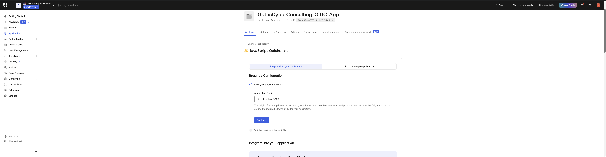

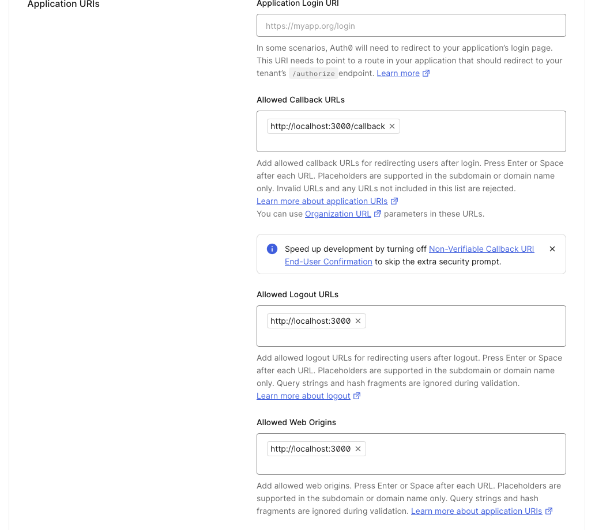

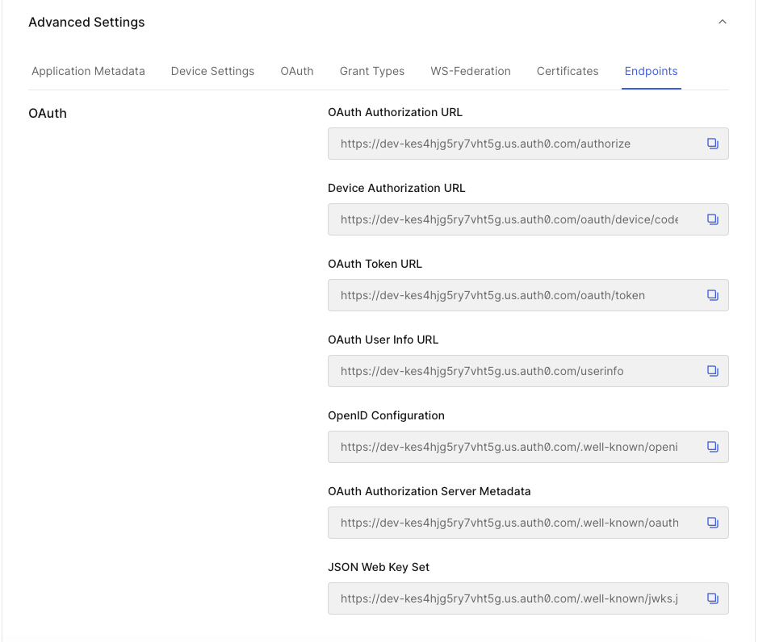

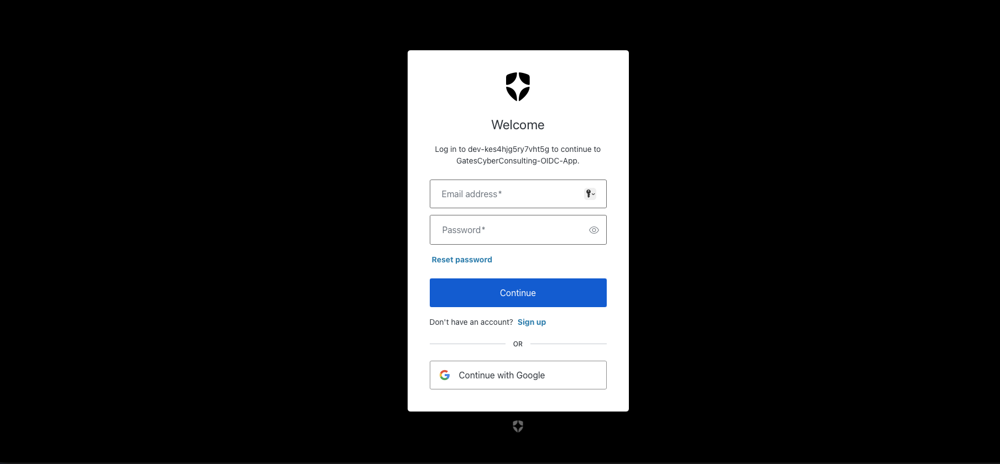

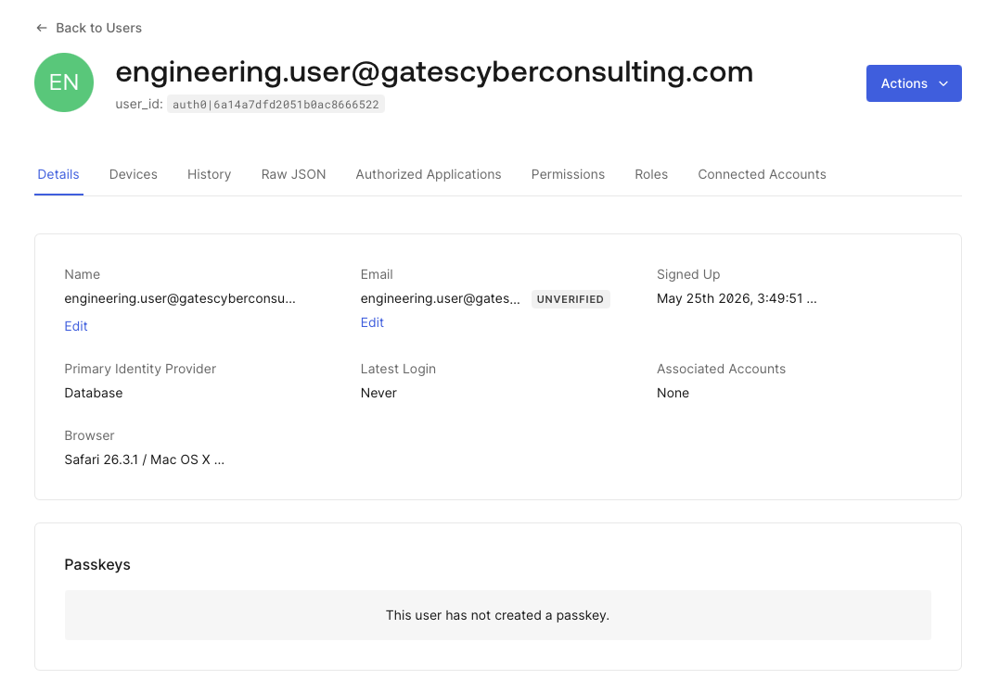

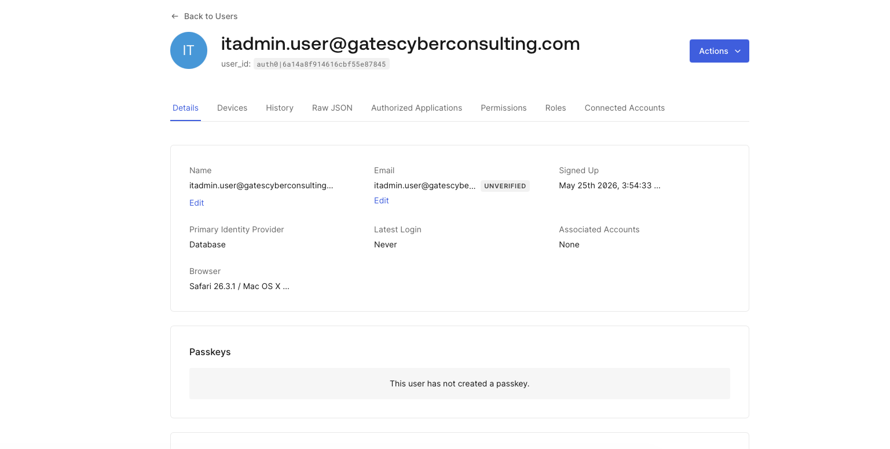

---

## Module 3 — Adaptive MFA + Policies

- Enabled One-time Password (TOTP) authenticator
- Set MFA policy to Always — all users required to enroll and verify
- Enabled Adaptive MFA Risk Assessment
- Created Engineering and IT-Admin roles with users assigned
- Completed end-to-end login: password auth → MFA enrollment → OTP verify → auth code issued
- Reviewed authentication logs confirming: Success Login, OTP Auth Succeed, MFA Enrollment

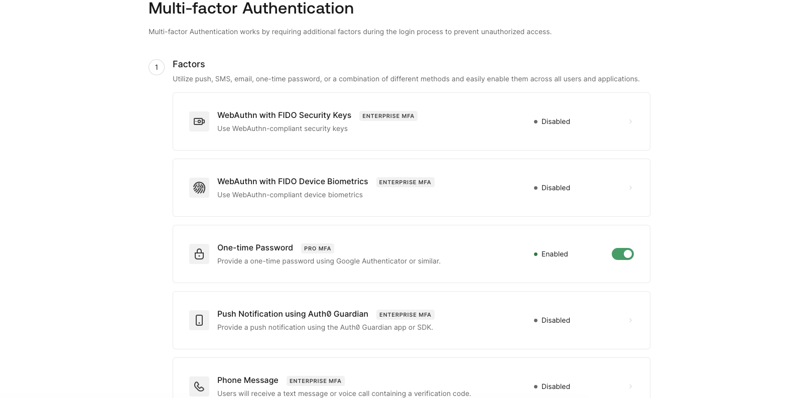

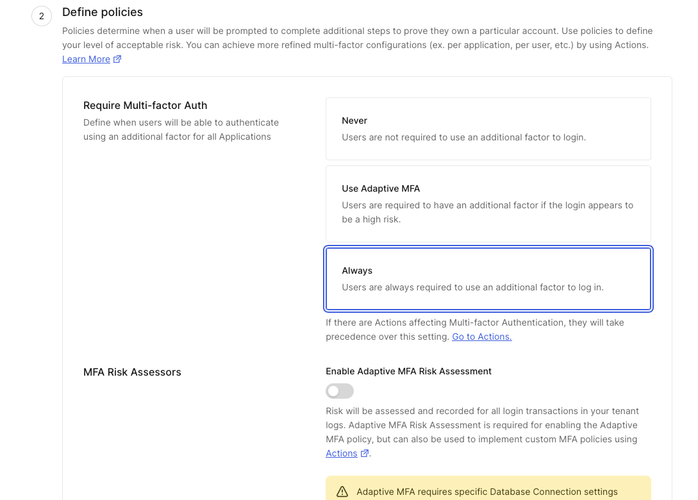

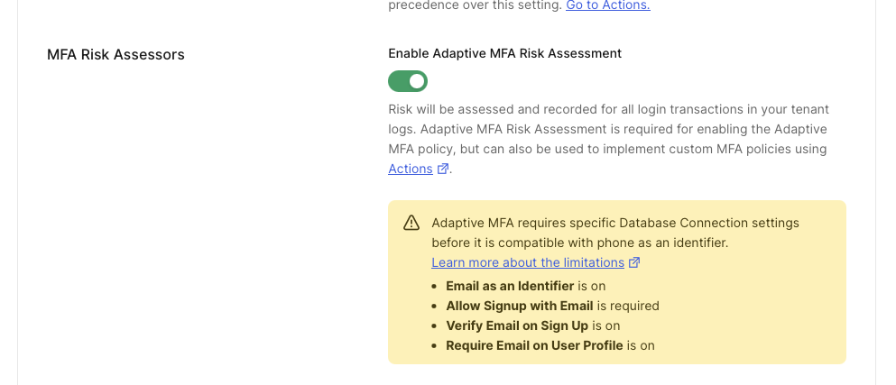

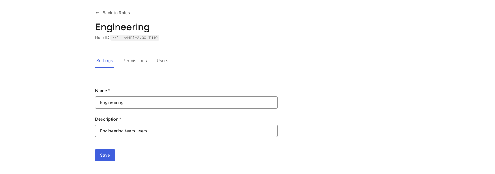

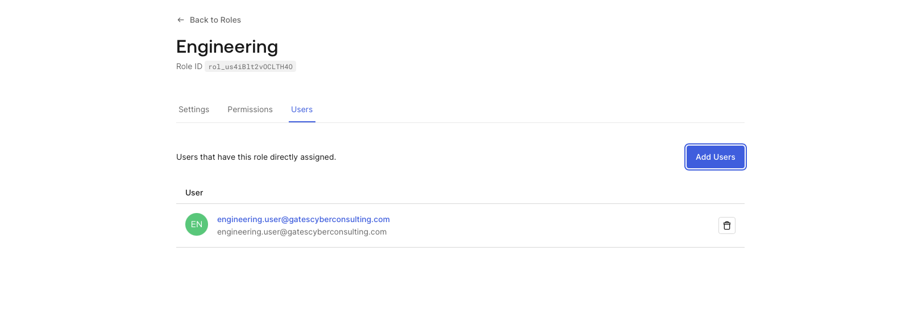

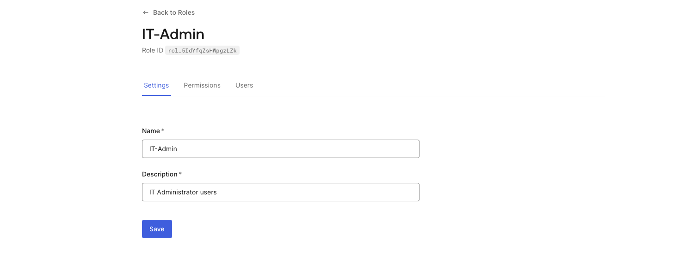

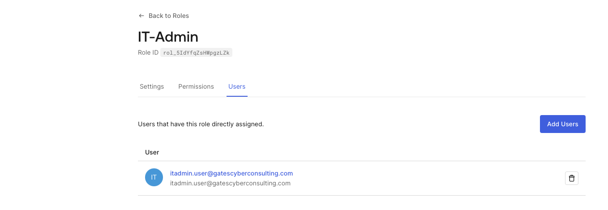

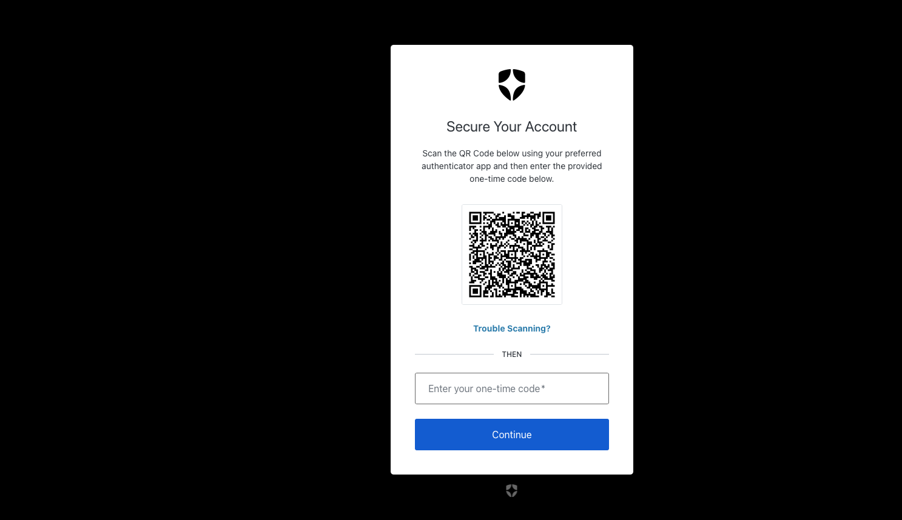

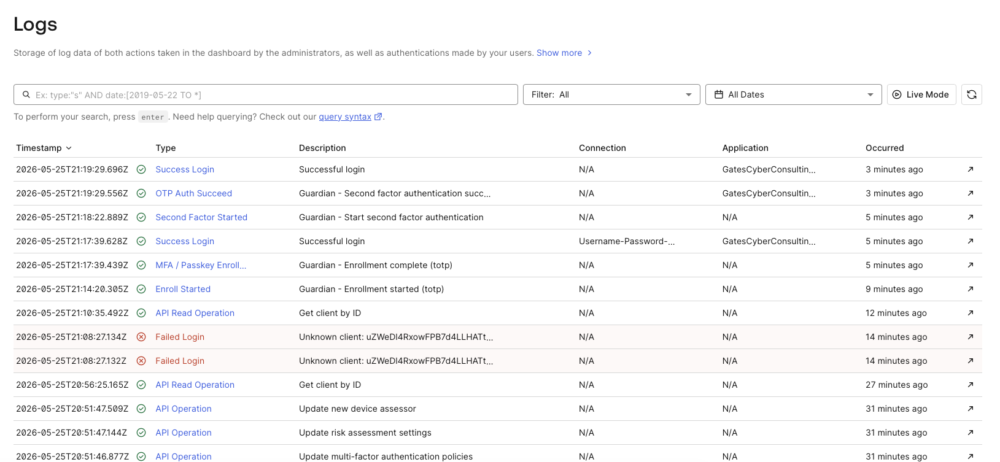

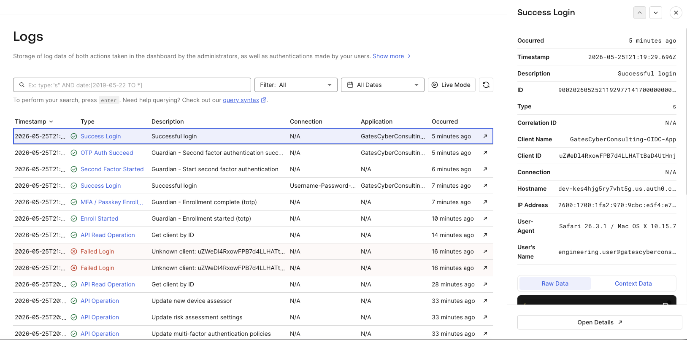

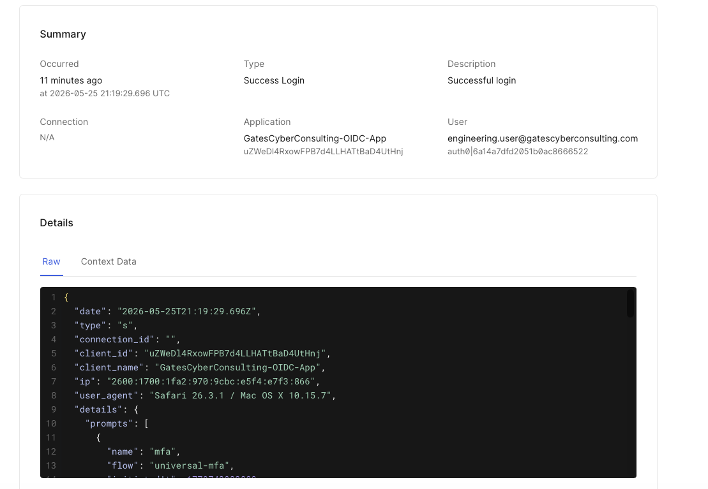

---

## Skills Demonstrated

| Skill | Evidence |
|-------|---------|
| OIDC / OAuth 2.0 | App configured, auth code flow tested |
| JWT / token analysis | Endpoints documented, auth code captured |
| MFA policy design | Always-on OTP, adaptive risk enabled |
| Role-based access control | Engineering + IT-Admin roles assigned |
| Authentication log analysis | Full event chain reviewed in Auth0 logs |
| Identity platform administration | Auth0 by Okta tenant configured end-to-end |

---

## Cross-Platform IAM Portfolio

| Project | Platform | Focus |
|---------|----------|-------|
| [JML Identity Lifecycle Automation](https://github.com/KennethGates/jml-identity-lifecycle) | Microsoft Entra ID + Graph API | Joiner/Mover/Leaver automation (Python) |
| [Azure Zero Trust Lab](https://github.com/KennethGates/azure-conditional-access-lab) | Azure / Entra ID | Conditional Access (6 policies) |
| [Cloud IAM Help Desk Lab](https://github.com/KennethGates/cloud-iam-helpdesk) | Azure | RBAC, PIM, access reviews |
| **Okta IAM Security Lab** | **Auth0 by Okta** | **OIDC, Adaptive MFA, RBAC** |

---

## Author

**Kenneth Gates**  
Cybersecurity professional | USAF Veteran | IAM & Cloud Security  
Certifications: AZ-500 · SC-300 · AWS Cloud Practitioner · Security+ · Network+  
[LinkedIn](https://linkedin.com/in/kennethgates) · [GitHub](https://github.com/KennethGates)
